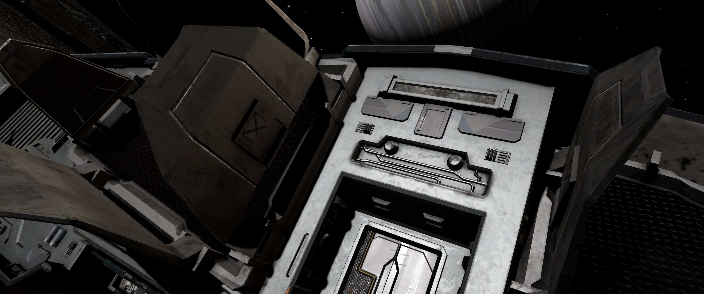

:PROPERTIES:
:ID:       0be96028-d995-4b52-8bb0-34f21e080bce
:ROAM_REFS: https://elite-dangerous.fandom.com/wiki/First_Thargoid_War https://elite-dangerous.fandom.com/wiki/John_Jameson
:END:
#+title: John Jameson
#+filetags: :Individual:Thargoid:3151:

* Death

At the end of the [[id:c6674165-eb13-47d3-ad54-796aab951892][First Thargoid War]] in 3151, Commander Jameson delivered the INRA mycoid weapon to a Thargoid hive ship and did not return. He is distinct from [[id:8123c0fb-6b91-4dc4-8162-23a31fc31db5][J. Jameson Jnr]], who received notice of [[id:af79e12c-6bc7-42ef-ade4-688b6454308a][Peter Jameson]]’s death in 3199.

* Family
  - [[id:cc697ecd-bd30-4319-b7f0-5e659a6e5b44][Jameson]]
  - [[id:1950129f-ad8e-453a-94ac-8bb0813e2e28][Lori Jameson]]
  - [[id:315a2182-7266-45f9-ac87-5f0f42c5cf12][Riri McAllister]]
* Job
  - Thargoids
  - [[id:39a31dd8-3750-4507-90b7-b649d0eeecef][INRA]]
  - [[id:e97884f4-b295-4bc7-9cc5-f79c1d2a6fbd][Mission]]
  - [[id:c6674165-eb13-47d3-ad54-796aab951892][First Thargoid War]]
* Ship
  - [[id:83299a14-b6b0-4670-ba39-2914e05ed2f5][Cobra Mk III]] at [[id:9ee9c706-4692-4578-8eaf-46ac00bea5aa][Crash Site]]
    
* Locations
  - [[id:ff595332-6a13-4f69-ae2f-cc0a0df8e741][Lave]]
