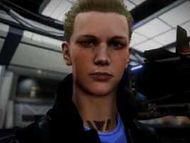

:PROPERTIES:
:ID:       1950129f-ad8e-453a-94ac-8bb0813e2e28
:ROAM_REFS: https://elite-dangerous.fandom.com/wiki/Lori_Jameson
:END:
#+title: Lori Jameson
#+filetags: :Federation:Individual:Combat:Rank:engineer:

#+begin_quote
Lori Jameson is one of the great granddaughters of [[id:0be96028-d995-4b52-8bb0-34f21e080bce][John Jameson]], the
most famous Pilots Federation member ever. She is an accomplished
explorer in her own right and has developed various techniques for
improved automated systems. Her facility is popular with those
seeking to prepare their ships for extended operations in deep
space, and she makes sure they have pleasant surroundings while they
await their upgrades.
#+end_quote

* Family
  [[id:cc697ecd-bd30-4319-b7f0-5e659a6e5b44][Jameson]]
* Location
[[id:145a3222-114e-46f0-8fb1-4f0b89766b5d][Jameson Base]] | [[id:c6b67ab9-66c5-4636-a978-2ca3a9ab012c][Shinrarta Dezhra]] [permit required]
* How to discover
From [[id:d18667b7-1da8-48ca-bb84-e280ebf77a35][Marco Qwent]] (grade 3-4).
* Meeting requirements
Gain [[id:4e05812c-0aba-4886-9f9f-969fbfb4446f][Combat Rank]] Dangerous or higher.
* Unlock requirements
Provide 25 units of [[id:f7f2b210-492a-441d-95ab-d5af4ea71edc][Kongga Ale]].
* Reputation gain
Craft modules for a major increase.
Sell exploration data to [[id:145a3222-114e-46f0-8fb1-4f0b89766b5d][Jameson Base]].
