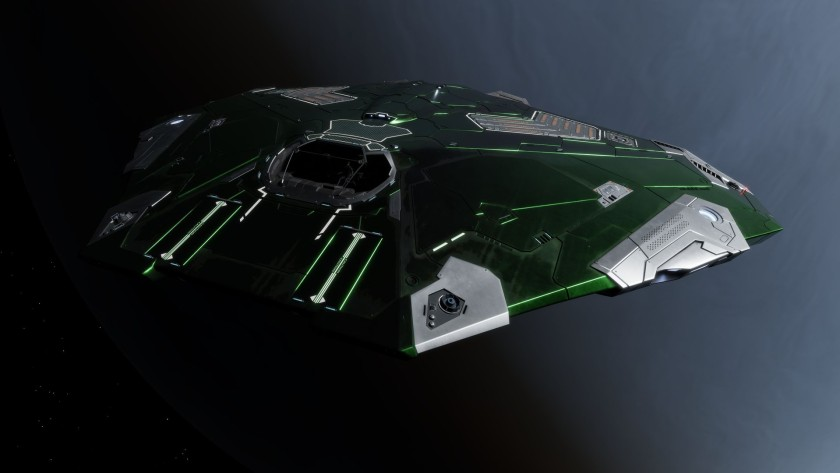

:PROPERTIES:
:ID:       83299a14-b6b0-4670-ba39-2914e05ed2f5
:ROAM_REFS: https://www.elitedangerous.com/equipment/starships/cobra-mk-iii
:END:
#+title: Cobra Mk III
#+filetags: :ship:

Ship used by [[id:0be96028-d995-4b52-8bb0-34f21e080bce][John Jameson]] and used by a member of [[id:7ec2457b-3e53-4928-a17f-e885b681b267][The Dark Wheel]] to kill [[id:abad5f3f-677b-40cc-9038-12eb558ec4cc][Jason Ryder]].

Also the ship you were playing with as impersonating [[id:0be96028-d995-4b52-8bb0-34f21e080bce][John Jameson]] in Elite+ in 1984.

* Shipyard Stats
- Fighter bay: No
- Multicrew: +1
- Landing pad size: SML
- Speeds: 282 m/s top, 403 m/s boost
- Maneuverability: 5
- Jump range: 9.85 ly laden, 11.16 ly unladen
- Durability: 92 shields, 216 armour
- Hull mass: 180 t
- Cargo capacity: 18 t
- Dimensions: 8 m high, 27.1 m long, 44 m wide
