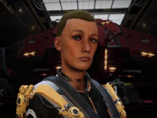

:PROPERTIES:
:ID:       cb71ba02-e47b-4feb-a421-b1f2ecdce6f3
:ROAM_REFS: https://elite-dangerous.fandom.com/wiki/Liz_Ryder
:END:
#+title: Liz Ryder
#+filetags: :Individual:engineer:

#+begin_quote
Liz Ryder is a demolitions expert who used to work for Devastator
and Sons, but left to work for a crime syndicate known as the Blue
Mafia. Some claim she had a personal relationship with a member of
the syndicate and was forced to leave Devastator and Sons when the
connection was discovered, starting Demolition Unlimited. The crime
organisation quickly saw the merits of her ability and have helped
her developed her team into something much bigger. Developing your
relationship with her will lead to an invitation from another
engineer.
#+end_quote

Connected to [[id:dbfbb5eb-82a2-43c8-afb9-252b21b8464f][NMLA]]

Works for [[id:e68a5318-bd72-4c92-9f70-dcdbd59505d1][Azimuth Biotech]] on [[id:6023377d-7271-49d1-80ec-ffab82dc8c29][AX weapons]]

* Family
  [[id:24e2cdd2-f3f3-45fa-9140-99711e77fd17][Ryder]]
* Location
Demolition Unlimited | [[id:0dbd55a5-68d9-45c4-9a80-b2e41f79554c][Eurybia]]
* How to discover
Public sources.
* Meeting requirements
Gain Cordial or Friendly status with [[id:bfb6fa92-52a2-4955-a1d7-4f11307f77fc][Eurybia Blue Mafia]].
* Unlock requirements
Provide 200 units of [[id:2b461b7b-10e3-49fd-ba61-bce15a046809][Landmines]].
* Reputation gain
Craft modules for a major increase.
Sell commodities to Demolition Unlimited.
