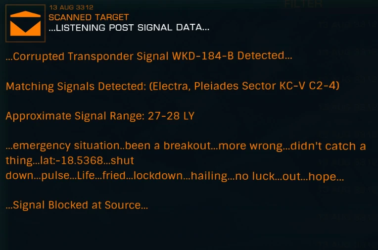

:PROPERTIES:
:ID:       7778d101-a0ed-4943-b9a7-b93aded323d9
:ROAM_REFS: https://canonn.science/codex/penal-colony-bv-2259/
:END:
#+title: Pleiades Sector PD-S b4-0 A 2
#+filetags: :ListeningPost:

A listening post related to the abandoned [[id:e121d10f-8ea7-4842-8988-4b3aec463ebf][Penal Colony BV-2259]] can be found near [[https://edgis.elitedangereuse.fr/static/sysmap.html?system=Pleiades+Sector+PD-S+b4-0&body_id=4][Pleiades Sector PD-S b4-0 A 2]].

#+begin_quote
…LISTENING POST SIGNAL DATA…

…Corrupted Transponder Signal WKD-184-B Detected…

Matching Signals Detected: ([[id:8e9b5a29-b9a6-4987-8fcd-91234a4a0acd][Electra]], [[id:287ae6a7-95e6-4a7a-9108-01f8995753fc][Pleiades Sector KC-V C2-4]])

Approximate Signal Range: 27-28 LY

…emergency situation…been a breakout…more wrong…didn’t catch a thing…lat:-18.5368…shut down…pulse…Life…fried…lockdown…hailing…no luck…out…hope…

…Signal Blocked at Source…
#+end_quote

