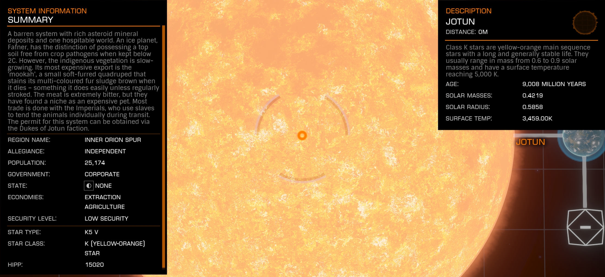

:PROPERTIES:
:ID:       addd8c74-2425-4d26-a1d5-9cb11ce6b0ba
:ROAM_REFS: https://elite-dangerous.fandom.com/wiki/Jotun
:END:
#+title: Jotun
#+filetags: :Empire:Reputation:System:Permit:

#+begin_quote
A barren system with rich asteroid mineral deposits and one
hospitable world. An ice planet, Fafner, has the distinction of
possessing a top soil free from crop pathogens when kept below 2C.
However, the indigenous vegetation is slow-growing. Its most
expensive export is the 'mookah', a small soft-furred quadruped that
stains its multi-coloured fur sludge brown when it dies - something
it does easily unless regularly stroked. The meat is extremely
bitter, but they have found a niche as an expensive pet. Most trade
is done with the Imperials, who use slaves to tend the animals
individually during transit.
#+end_quote

[[file:img/permit.png]]
Faction: [[id:0ebec0eb-5f68-47f5-9a0e-dd1b47f140f7][Dukes of Jotun]]
Benefits: Access to Rare Good (Juton Mookah)
Note: Blanquichu has a HAZ RES where you can boost your influence.

* Info
  Ce système désolé ne possède qu'un seul monde hospitalier, même si
  les ressources en minerais de ses astéroïdes suscitent bien des
  convoitises. Fafner est une planète glacée, dont le sol possède une
  intéressante particularité : tant que sa température ne dépasse pas
  les 2°C, il demeure vierge de presque tout agent pathogène
  susceptible de nuire aux plants de céréales. Toutefois, la
  croissance de la végétation indigène est très lente. Le « [[id:ec311682-8833-4b4d-9844-f6b720691677][mookah]] »
  fait la renommée de la planète. Ce petit quadrupède à la douce
  fourrure multicolore est plus adapté aux riches demeures qu'aux
  cuisines des restaurants. Car, si sa viande est amère, il se révèle
  un adorable petit compagnon. Un mookah requiert toutfois beaucoup
  d'attention. Négligé, il a en effet une fâcheuse tendance à se
  laisser mourir. Sa fourrure prenant alors une couleur
  brunâtre. L'animal est surtout exporté dans l'Empire, où il est
  particulièrement apprécié. Sa valeur est telle que l'on affect
  généralement un esclave à son bien-être durant le
  transport. Autorisation délivrée par la faction Dukes of [[id:addd8c74-2425-4d26-a1d5-9cb11ce6b0ba][Jotun]].

Rare commodity source: [[id:49e47710-c7cc-4253-95b4-f882929e3d4d][Jotun Mookah]] at [[id:4a7a1d62-f757-4e87-adc4-38f25dc82f60][Icelock]].
