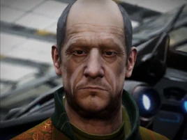

:PROPERTIES:
:ID:       f7a5d9f8-1d86-4230-ab52-397226590b19
:ROAM_REFS: https://elite-dangerous.fandom.com/wiki/Broo_Tarquin
:END:
#+title: Broo Tarquin
#+filetags: :Individual:Rank:engineer:

#+begin_quote
Broo Tarquin was the founder of Dead-Eye Defence Systems, now part
of the Thule Industries. Since he retired from his role as chief
designer, he spends his days tinkering in his workshop and drinking
exotic tea. Since then, others have joined him in his work and his
workshop has expanded into a wider operation, making components from
their own smelted alloys. Developing your relationship with him will
lead to an invitation to another engineer.
#+end_quote

* Location
Broo's Legacy | [[id:773cc22e-e884-4ee2-82d4-54d531fc8f23][Muang]]

* How to discover
From [[id:c7c72092-6fb9-4c3e-865b-d16661a11cdb][Hera Tani]] (grade 3-4).
* Meeting requirements
Gain Combat Rank Competent or higher.
* Unlock requirements
Provide 50 units of Fujin Tea.
* Reputation gain
Craft modules for a major increase.
Hand in bounty vouchers to Broo's Legacy.
