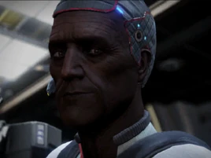

:PROPERTIES:
:ID:       d4d3395f-e02f-4d84-95e1-6c3367c1c957
:ROAM_REFS: https://elite-dangerous.fandom.com/wiki/Juri_Ishmaak
:END:
#+title: Juri Ishmaak
#+filetags: :Individual:engineer:

#+begin_quote
Juri Ishmaak is an ambitious combat specialist whose father was a
pilot in a mercenary wing. He followed in his father's footsteps
operating with the wing. He believes in careful preparation before
any combat. After retiring from combat he set up a base of
operations to focus on his passion for engineering. Develop your
relationship with him to learn about another engineer.
#+end_quote

* Location
Pater's Memorial | [[id:31bfe4e0-1652-4327-a197-ff71c71cc6c3][Giryak]]
* How to discover
From [[id:d512672e-8849-46f9-b39d-a53f0c5765bf][Felicity Farseer]] (grade 3-4).
* Meeting requirements
Earn more than 50 [[id:bbbc7bc6-79d7-46b7-925e-c1f882c8f25a][Combat Bonds]].
* Unlock requirements
Provide 100,000 or 1,000,000 credits worth of combat bonds (the amount
needed depends on the currently unknown conditions).
* Reputation gain
Craft modules for a major increase.
Hand in bounty vouchers or combat bonds to Pater's Memorial.
