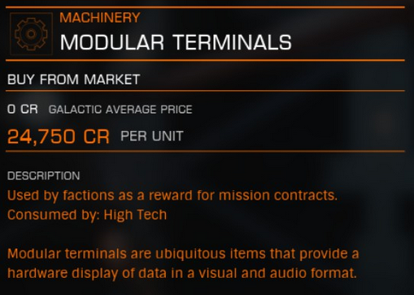

:PROPERTIES:
:ID:       f2e6761a-3e97-4f9b-96bc-a692de5e3cc3
:END:
#+title: Modular Terminals
#+filetags: :Commodity:

#+begin_quote
Used by factions as a reward for mission contracts.

Modular terminals are ubiquitous items that provide a hardware
display of data in a visual and audio format.
#+end_quote

Category: Machinery
Produced by: Mission Rewards
Consumed by: Any

Sources: in-game commodity description, mirrored at [[https://elite-dangerous.fandom.com/wiki/Modular_Terminals][Fandom: Modular Terminals]]

