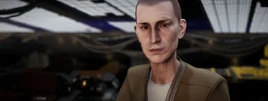

:PROPERTIES:
:ID:       51b52a91-d8d7-4df9-a03e-43803749da06
:ROAM_REFS: https://elite-dangerous.fandom.com/wiki/Marsha_Hicks
:END:
#+title: Marsha Hicks
#+filetags: :Individual:engineer:

#+begin_quote
Marsha Hicks has been in and out of more penitentiaries than she can
count. She decided to go straight and move out to Colonia after the
death of her daughter, when the Thargoids attacked Bhal. She doesn't
like dealing with people, but everyone has to make a living and
working as an engineer is better than going back to jail.
#+end_quote

* Location
The Watchtower | [[id:92869a29-f1f2-4437-8d8d-b8c8bfa4212d][Tir]]
* How to discover
From [[id:bcdb8e96-5958-4167-b0ec-67b7daa1086e][The Dweller]] (grade 3-4).
* Meeting requirements
Gain [[id:97011475-07b1-4e6e-9787-6492f9f952c9][Exploration Rank]] Surveyor or higher.
* Unlock requirements
Mine 10 units of [[id:89bb247d-d459-4ebf-a000-698cd1d9c5fe][Osmium]].
* Reputation gain
Craft modules for a major increase.
