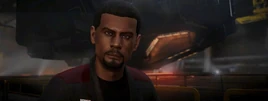

:PROPERTIES:
:ID:       2fce62b3-399d-4ef7-b93b-00a0de6cc4be
:ROAM_REFS: https://elite-dangerous.fandom.com/wiki/Mel_Brandon
:END:
#+title: Mel Brandon
#+filetags: :Individual:engineer:

#+begin_quote
Mel Brandon is a specialist in laser-based weaponry, shields, frame
shift drives and engines. He was dishonourably discharged from the
Federal Defence Force for disobeying a senior officer who ordered a
combat strike on a labour protest, but he was popular in the
service, and retains some useful contacts. Many of his comrades-in-
arms have since joined him in his business.
#+end_quote

* Location
The Brig | [[id:d3daf803-d239-4314-81cd-22cbb7db8424][Luchtaine]]
* How to discover
From [[id:887ca01b-ea5d-4fcd-a45d-de1ca598f1cd][Elvira Martuuk]] (grade 3-4).
* Meeting requirements
Gain invitation from [[id:6b6559fd-c7fa-44c9-b540-b94ddcadbd50][Colonia Council]].
* Unlock requirements
Provide 100,000 credits worth of bounty vouchers.
* Reputation gain
Craft modules for a major increase.
