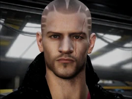

:PROPERTIES:
:ID:       610da0b4-4f53-45b6-80a7-704ef14cf16f
:ROAM_REFS: https://elite-dangerous.fandom.com/wiki/Tod_%22The_Blaster%22_McQuinn
:END:
#+title: Tod "The Blaster" McQuinn
#+filetags: :Alliance:Individual:engineer:

#+begin_quote
Tod McQuinn earned his nickname from a successful season in the CQC
Arena. Since then he's garnered further fame as a bounty hunter,
flying a Fer-de-Lance with seriously overpowered multi-cannons. He's
always happy to help fellow bounty hunters. For his current venture
he's teamed up with some of his old CQC friends to form a a custom
modification enterprise. Develop your relationship with him to learn
about another Engineer.
#+end_quote

* Location
Trophy Camp | [[id:904e09fa-f2a2-4420-a80c-695eebebb61e][Wolf 397]]
* How to discover
Common knowledge.
* Meeting requirements
Earn more than 15 [[id:5402969f-345d-420c-9025-3a0a89929d11][Bounty Vouchers]].
* Unlock requirements
Provide 100,000 credits worth of bounty vouchers.
* Reputation gain
Craft modules for a major increase.
Hand in Alliance bounty vouchers to Trophy Camp.
