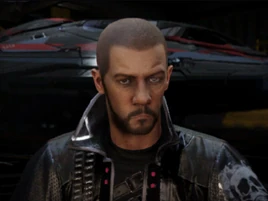

:PROPERTIES:
:ID:       baab0645-10f6-4242-998a-b3c899f459a2
:ROAM_REFS: https://elite-dangerous.fandom.com/wiki/Zacariah_Nemo
:END:
#+title: Zacariah Nemo
#+filetags: :Individual:engineer:

#+begin_quote
Zacariah has been at the centre of a small cult-like commune for
decades now, the Nemo Cyber Party. Rumour has it that he has a
cyber-enhanced brain, and can take vast information dumps directly
to it. His skill with weapons manufacturing and modification is made
available to those favoured by the Party. He has attracted a growing
group of "cyber-freaks" who are usually shunned in normal society.
He has a vast collection of automata. Develop your relationship with
him to discover another engineer.
#+end_quote

Works for [[id:e68a5318-bd72-4c92-9f70-dcdbd59505d1][Azimuth Biotech]] on [[id:6023377d-7271-49d1-80ec-ffab82dc8c29][AX weapons]]

* Location
Nemo Cyber Party Base | [[id:aed62d3e-1569-4c72-80f5-d1b334b70fef][Yoru]]
* How to discover
From [[id:887ca01b-ea5d-4fcd-a45d-de1ca598f1cd][Elvira Martuuk]] (grade 3-4).
* Meeting requirements
Gain invitation from [[id:ad39a12d-64a8-45e0-a3be-80b9a46ace0c][Party of Yoru]].
* Unlock requirements
Provide 25 units of [[id:d87e7cd1-ab29-4120-a3f8-a41ca1bf7e58][Xihe Biomorphic Companions]].
* Reputation gain
Craft modules for a major increase.
Sell commodities to Nemo Cyber Party Base.
