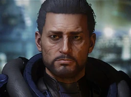

:PROPERTIES:
:ID:       40542b10-7154-42fc-a1c8-320c5ac73275
:ROAM_REFS: https://elite-dangerous.fandom.com/wiki/Jude_Navarro
:END:
#+title: Jude Navarro
#+filetags: :Individual:OnFoot:engineer:

#+begin_quote
The son of a freedom fighter killed defending his home system, Jude
entered military service as soon as he was able to continue his
family's struggle. Years of resistance in an under-equipped militia
wore on him until injuries sustained in combat forced him to retire.
Jude now puts his engineering talents to use for private clients,
but is rumoured to send much of it to family and former comrades.
#+end_quote

* Location
Marshall's Drift | [[id:e276c373-f561-42b9-8bdb-bf34d7a1a7e1][Aurai]]
* How to discover
Common knowledge.
* Unlock requirements
Complete 10 Restore or Reactivation missions.
* Referral requirements
Provide 5 units of [[id:ec8eace0-21f5-47d7-8a8c-664c86cec659][Genetic Repair Meds]].
