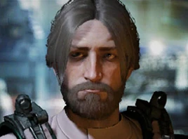

:PROPERTIES:
:ID:       d8266505-5aa0-40a3-aa84-4b6519a16b24
:ROAM_REFS: https://elite-dangerous.fandom.com/wiki/Kit_Fowler
:END:
#+title: Kit Fowler
#+filetags: :Individual:OnFoot:engineer:

#+begin_quote
Politically conscientious from adolescence, Kit has a reputation for
indulging fringe ideologies and conspiracy. An aptitude for
engineering makes it easy for him to find work; this income funds an
independent broadcast called 'End Times' that serves as a platform
for his paranoid rants and apocalyptic predictions.
#+end_quote

* Location
The Last Call | [[id:9c8a11b6-db1b-4e65-8ee2-21f6483da85a][Capoya]]
* How to discover
From [[id:3bb893ed-19f4-4cf2-90ce-a5f0deea8220][Domino Green]]
* Unlock requirements
Sell 10 [[id:d22c7b5b-2965-452f-9b1c-77de0b601cf8][Opinion Polls]] to bartenders.
* Referral requirements
Provide 5 units of [[id:55669e4c-6120-4f4a-93a1-ddcc366333c5][Surveillance equipment]].
