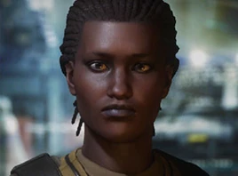

:PROPERTIES:
:ID:       e543dd6e-96f5-4d65-a45f-32a5586ad511
:ROAM_REFS: https://elite-dangerous.fandom.com/wiki/Rosa_Dayette
:END:
#+title: Rosa Dayette
#+filetags: :Individual:OnFoot:engineer:

#+begin_quote
As a child, Rosa often tinkered with the gadgets in her home to
revere-engineer them and learn how they worked. Her natural talent
blossomed over the years as she offered her services to anyone with
faulty tech, building a reputation across her home starport. She
eventually apprenticed with an experienced suit mechanic, learning
to apply her skills to combat equipment. Rosa's charitable nature
and focus on community was eventually rewarded with her own
workshop, paid for by thousands of donations from friends, family
and customers accrued over the years.
#+end_quote

* Location
Rosa's Shop | [[id:23c19e19-16f1-4584-a547-47a013a65360][Kojeara]]
* How to discover
Common knowledge.
* Unlock requirements
Sell a total of 10 [[id:528fdf07-ef32-4a7e-9bec-beae1cc93cf9][Culinary Recipes]] or [[id:89d50716-eb98-413b-8f5c-2bb7602f3f46][Cocktail Recipes]] to stations in
[[id:ba6c6359-137b-4f86-ad93-f8ae56b0ad34][Colonia]].
* Referral requirements
Provide 10 units of [[id:96b9711c-d642-408a-916c-a762617c1f88][Manufacturing Instructions]] data.
