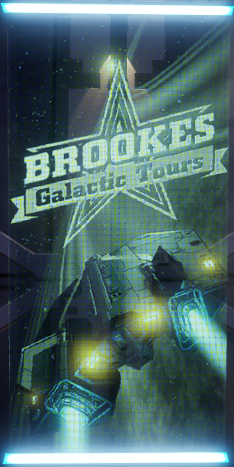

:PROPERTIES:
:ID:       e483f87f-540e-4f2b-8211-a8d46f2b41e3
:ROAM_ALIASES: "Brookes Memorial Series - Beacon 5/5"
:END:
#+title: Surrounded By Wonder
#+filetags: :tourist:beacon:
* 0749 Surrounded By Wonder

Brookes Memorial Series - Beacon 5/5
"Where Michael rests now is a matter of rumour.

To say his spirit quietly rests is at odds with the person many
knew. There was also a new experience to pursue. The next frontier to
discover. Many discussions of Michael’s legacy turn, inevitably,
towards one such undiscovered entity: [[id:a2bd8247-2daf-4bd9-b6da-667ff707b0a2][Raxxla]].

A mythological something that stirs wonder among every spacer, this
undefined myth remains elusive. But experienced pilots will tell you:
If anybody knows the way to Raxxla, [[id:e9a37bf8-a24d-4fb9-9dc2-77a87576aad7][Michael Brookes]] does."

And fast by, hanging in a golden chain,
This pendent world, in bigness as a star
Of smallest magnitude, close by the [[id:e998c95c-a76f-4312-a8c2-3a8706232ae9][moon]].

