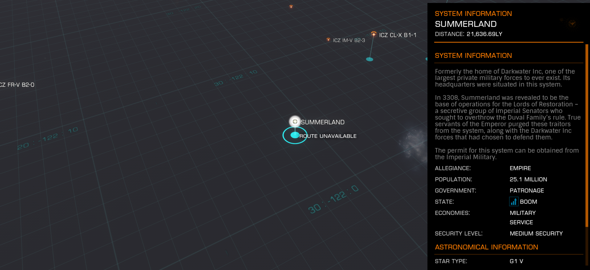

:PROPERTIES:
:ID:       ba152f8a-d8af-4611-b8ac-0b32f3258dd0
:ROAM_REFS: https://elite-dangerous.fandom.com/wiki/Summerland
:END:
#+title: Summerland
#+filetags: :Rank:Permit:System:

#+begin_quote
Formerly the home of [[id:57907627-04a8-4987-96c2-535c101e958b][Darkwater Inc]], one of the
largest private military forces to ever exist. Its
headquarters were situated in this system.

In 3308, Summerland was revealed to be the
base of operations for the [[id:ffa239ce-f149-4c43-9455-26a4fa753e1c][Lords of Restoration]] -
a secretive group of Imperial Senators who
sought to overthrow the [[id:bce02e51-c68c-4594-86fe-88dda4915a74][Duval Family]]'s rule. True
servants of the [[id:34f3cfdd-0536-40a9-8732-13bf3a5e4a70][Emperor]] purged these traitors
from the system, along with the [[id:57907627-04a8-4987-96c2-535c101e958b][Darkwater Inc]]
forces that had chosen to defend them.

The permit for this system can be obtained from the Imperial Military.
#+end_quote

[[file:img/permit.png]]

Rank: Lord

