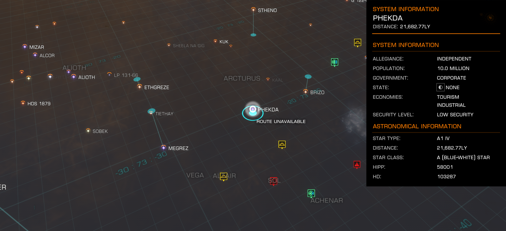

:PROPERTIES:
:ID:       686a1ef0-80ad-48c0-b2b5-f2da43b333f1
:ROAM_REFS: https://elite-dangerous.fandom.com/wiki/Phekda
:END:
#+title: Phekda
#+filetags: :System:Permit:

#+begin_quote
A rare anarchy system that maintains a powerful industrial economy.
Also known as Gamma Ursae Majoris and Phad.The home system for The
Ancients of Mumu who are adherents to the entity "Mumu". Their aim
is to maintain the substance and nature of their society and protect
their home system from incursion by any non-believers. Founded in
the 12th century, while still planet bound on Mother Earth, the
(then) Adherents of Mumu sought to better their environment for the
benefit of others.When the first generation ships were due to leave
Earth their society sought to colonise a system far from Earth as
they believed that Earth itself was not worth saving. The colonists,
by and large, survived the journey, arriving several hundred years
ago. A significant proportion of the first settlers had developed a
sincere hatred of space travel by the time they made first
landing.Since their arrival they have grown particularly attached to
their home and have transformed into a community that is fiercely
protective of its chosen system and resistant to any attempts at
visitation by those who have not been granted access.
#+end_quote

[[file:img/permit.png]]

