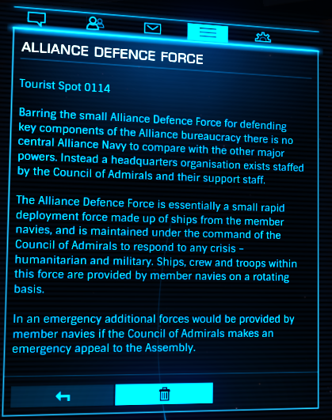

:PROPERTIES:
:ID:       17d9294e-7759-4cf4-9a67-5f12b5704f51
:ROAM_ALIASES: ADF
:END:
#+title: Alliance Defence Force
#+filetags: :Tourist:History:beacon:Alliance:
* 0114 [[id:17d9294e-7759-4cf4-9a67-5f12b5704f51][Alliance Defence Force]]
[[id:5c4e0227-24c0-4696-b2e1-5ba9fe0308f5][Alioth]]

Barring the small [[id:17d9294e-7759-4cf4-9a67-5f12b5704f51][Alliance Defence Force]] for defending key components
of the Alliance bureaucracy there is no central Alliance Navy to
compare with the other major powers. Instead a headquarters
organisation exists staffed by the [[id:b0b347ac-10b8-4190-8787-1557f7d4a6da][Council of Admirals]] and their
support staff.

The [[id:17d9294e-7759-4cf4-9a67-5f12b5704f51][Alliance Defence Force]] is essentially a small rapid deployment
force made up of ships from the member navies, and is maintained under
the command of the [[id:b0b347ac-10b8-4190-8787-1557f7d4a6da][Council of Admirals]] to respond to any crisis -
humanitarian and military.

In an emergency additional forces would be provided by member navies
if the [[id:b0b347ac-10b8-4190-8787-1557f7d4a6da][Council of Admirals]] makes an emergency appeal to the Assembly.

