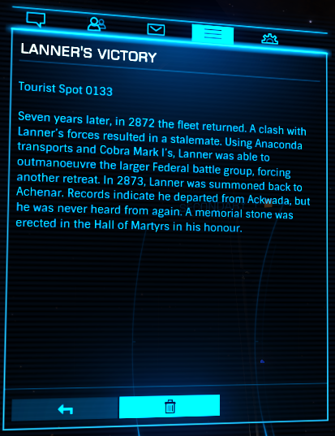

:PROPERTIES:
:ID:       e2a0bea1-7283-40c0-90d0-34ad5526858c
:END:
#+title: Lanner's Victory
#+filetags: :Tourist:History:beacon:Federation:
* 0133  Lanner's Victory
[[id:77a7a843-4242-4da8-a764-c1525e6ceefe][Ackwada]]

Seven years later, in 2872 the fleet returned. A clash with Lanner's forces resulted in a stalemate. Using Anaconda transports and Cobra Mark I's, Lanner was able to outmanoeuvre the larger Federal battle group, forcing another retreat. In 2873, Lanner was summoned back to [[id:bed8c27f-3cbe-49ad-b86f-7d87eacf804a][Achenar]], Records indicate he departed from [[id:77a7a843-4242-4da8-a764-c1525e6ceefe][Ackwada]], but he was never heard from again. A memorial stone was erected in the Hall of Martyrs in his honour.                                                                                                                                                                                                                                                                                                                                                                                                                                                                                                                                                                                                                                                                                                                                                                                                                                                                                                                                                                                                                                                                                                                                                                                                                                                                                                                                                                                                                                                                                                                                                                                                                                                                                                                                                                                                                                                                                                                                                                                                                                                                                                                                                                                                                                                                                                                                                                                                                                                                                                                                                                                                       

