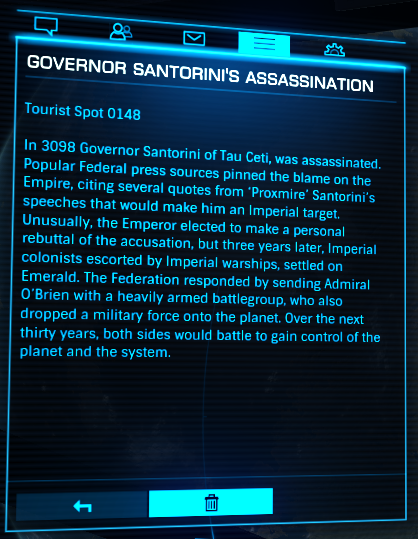

:PROPERTIES:
:ID:       fed0655d-b1b6-4136-adf7-9e688793af93
:END:
#+title: Governor Santorini's Assassination
#+filetags: :Tourist:History:beacon:Empire:Federation:
* 0148 Governor Santorini's Assassination
[[id:000181d2-87fb-4eac-9c05-378082def97f][Tau Ceti]]

In 3098 Governor [[id:9492a08d-0edc-46db-969f-dc8670665346][Santorini]] of [[id:000181d2-87fb-4eac-9c05-378082def97f][Tau Ceti]] was assassinated. Popular
Federal press sources pinned the blame on the Empire, citing several
quotes from '[[id:51b0d41b-a703-4487-9227-7d4ed35293fe][Proxmire]]' Santorini's speeches that would make him an
imperial target. Unusually, the Emperor elected to make a personal
rebuttal of the accusation, but three years later, Imperial colonists
escorted by Imperial warships, settled on [[id:465800ad-1e27-44fa-9b4b-5ca23bcc36ce][Emeral]]. [[id:d56d0a6d-142a-4110-9c9a-235df02a99e0][The Federation]]
responded by sending [[id:023eef0b-13ab-4af0-8c43-bd0b6bcbd6b8][Admiral O'Brien]] with a heavily armed battlegroup,
who also dropped a military force onto the planet. Over the next
thirty years, botn sides would battle to gain control of the planet
and the system.

