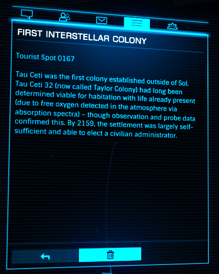

:PROPERTIES:
:ID:       6a65a710-1048-436d-9ced-bd452203e945
:END:
#+title: First Interstellar Colony
#+filetags: :Tourist:History:beacon:2159:
* 0167 First Interstellar Colony
[[id:000181d2-87fb-4eac-9c05-378082def97f][Tau Ceti]]

[[id:000181d2-87fb-4eac-9c05-378082def97f][Tau Ceti]] was the first colony established outside of [[id:6ace5ab9-af2a-4ad7-bb52-6059c0d3ab4a][Sol]]. [[id:000181d2-87fb-4eac-9c05-378082def97f][Tau Ceti]] 3
(now called [[id:ee59bbe7-79e2-49ae-a2bc-c25554526ea3][Taylor Colony]]) had long been determined viable for
habitation with life already present (due to free oxygen detected in
the atmosphere absorption spectra) - though observation and probe data
confirmed this. By 2159, the settlement was largely self-sufficient
and able to elect a civilian administrator.

