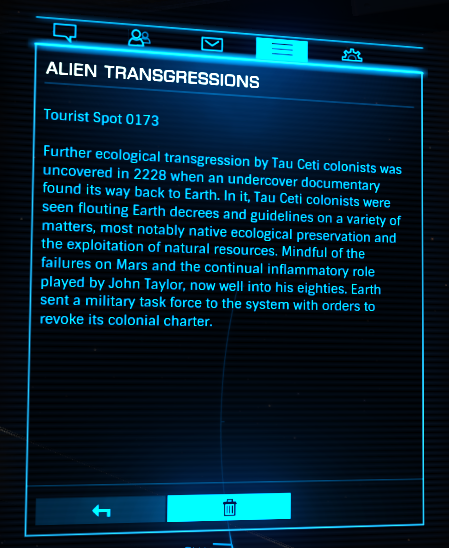

:PROPERTIES:
:ID:       ee42ce48-62b5-465a-bdb0-7b12f97f4ad7
:END:
#+title: Alien Transgressions
#+filetags: :Tourist:History:beacon:
* 0173 Alien Transgressions
[[id:000181d2-87fb-4eac-9c05-378082def97f][Tau Ceti]]

Further ecological transgression by [[id:000181d2-87fb-4eac-9c05-378082def97f][Tau Ceti]] colonists was uncovered
in 2228 when an undercover documentary found its way back to [[id:5b0f485f-4793-468d-a1a1-483606f44e0e][Earth]]. In
it, [[id:000181d2-87fb-4eac-9c05-378082def97f][Tau Ceti]] colonists were seen flouting Earth decrees and guidelines
on a variety of matters, most notably native ecological preservation
and the exploitation of natural resources. Mindful of the failure on
[[id:8a55a32e-316d-469b-a19f-bdc7c4d4b018][Mars]] and the continual infammatory role played by [[id:a4ba2bf5-102c-4593-b99c-a35616993d58][John Taylor]], now
well into his eighties. Earth sent a military task force to the system
with order to revoke its colonial charter.

