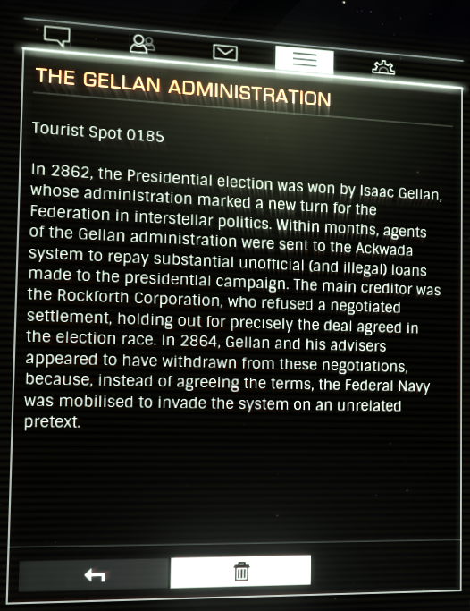

:PROPERTIES:
:ID:       91748ef8-f440-47c1-b587-7b783a3fb428
:END:
#+title: The Gellan Administration
#+filetags: :Tourist:History:beacon:Federation:
* 0185 The Gellan Administration
[[id:77a7a843-4242-4da8-a764-c1525e6ceefe][Ackwada]]

In 2862, the Presidential election was won by [[id:77091a28-dc28-405d-bb97-c32a1aecdd33][Isaac Gellan]], whose
administration marked a new turn for the Federation in interstellar
politics. Within months, agents of the Gellan administration were sent
to the [[id:77a7a843-4242-4da8-a764-c1525e6ceefe][Ackwada]] system to repay substantial unofficial (and illegal)
loans made to the presidential campaign. The main creditor was the
Rockforth Corporation, who refused a negotiated settlement, holding
out for precisely the deal agreed in the election race. In 2864,
Gellan and his advisers appeared to have withdrawn from these
negotiations, because, instead of agreeing the terms, the Federal Navy
was mobilised to invade the system on an unrelated pretext.

