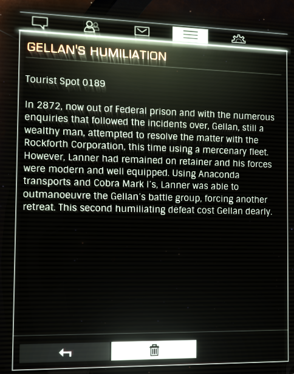

:PROPERTIES:
:ID:       61410acc-b6b5-4cf2-a171-f064123841f9
:END:
#+title: Gellan's Humiliation
#+filetags: :Tourist:History:beacon:Federation:
* 0189 Gellan's Humiliation
[[id:77a7a843-4242-4da8-a764-c1525e6ceefe][Ackwada]]

In 2872, now out of Federal prison and with the numerous enquiries
that followed the incidents over, [[id:77091a28-dc28-405d-bb97-c32a1aecdd33][Gellan]], still a wealthy man,
attempted to resolve the matter with the Rockforth Corporation, this
time using a mercenary fleet. However, Lanner had remained on retainer
and his forces were modern and well equipped. Using Anaconda
transports and Cobra Mark I's, Lanner was able to outmanoeuvre
Gellan's battle group, forcing another retreat. This second
humiliating defeat cost Gellan dearly.

