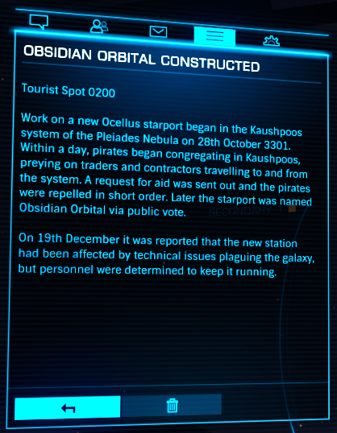

:PROPERTIES:
:ID:       2ac67d25-58ef-49da-824a-49537d7ce96a
:END:
#+title: Obsidian Orbital Constructed
#+filetags: :Tourist:History:beacon:3301:
* 0200 Obsidian Orbital Constructed
[[id:0ee60994-364c-41b9-98ca-993d041cea72][Maia]]

Work on a new [[id:5700c476-8bf4-4710-90d9-1e5988bf6048][Ocellus]] starport began in the [[id:3ceec3b8-48ce-40e3-8b24-ba6fe065d56c][Kaushpoos]] system of the
Pleiades Nebula on 28'th October 3301. Within a day, pirates began
congregating in [[id:3ceec3b8-48ce-40e3-8b24-ba6fe065d56c][Kaushpoos]], preying on traders and contractors
travelling to and from the system. A request for aid was sent out and
the pirates were repelled in short order. Later the starport was named
[[id:4223b99a-7e0c-44fa-b7e9-afeca7e0c031][Obsidian Orbital]] via public vote.

On 19th December it was reported that the new station had been
affected ny technical issues plagueing the galaxy, but personnel were
determined to keep it running.

