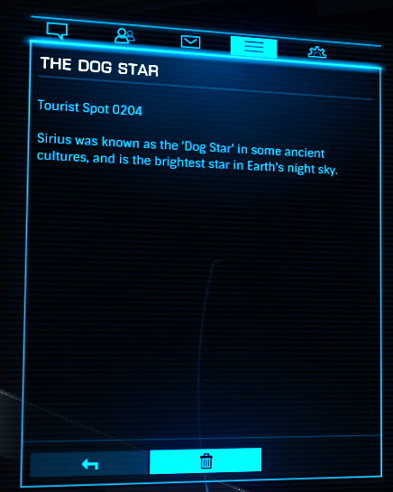

:PROPERTIES:
:ID:       7f992e42-9632-425e-a69c-fa3c07c1748d
:END:
#+title: The Dog Star
#+filetags: :Tourist:History:beacon:
* 0204 The Dog Star
[[id:83f24d98-a30b-4917-8352-a2d0b4f8ee65][Sirius]]

Sirius was known as the 'Dog Star' in some ancient cultures, and is
the brightest star in Earth's night sky.

