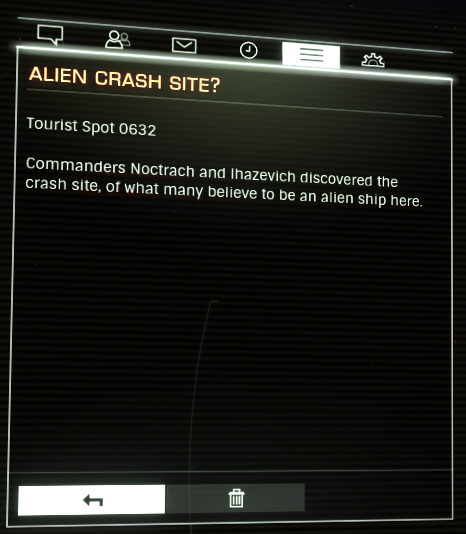

:PROPERTIES:
:ID:       290ad3a5-bb4c-4d5a-b5c1-d279e691b2d5
:END:
#+title: Alien Crash Site
#+filetags: :beacon:
* 0632 Alien Crash Site?
[[id:c32901ed-73d1-4ca6-aeb8-5bcd795d1036][Pleiades Sector AB-W B2-4]]

Commanders [[id:44d263ee-bae7-40d3-b4e0-dc069d122aaa][Noctrach]] and [[id:2e2fb451-7106-49ad-b425-20faf5cc21bc][Ihazevich]] discovered the crash site, of what
many believe to be an alien ship here.

