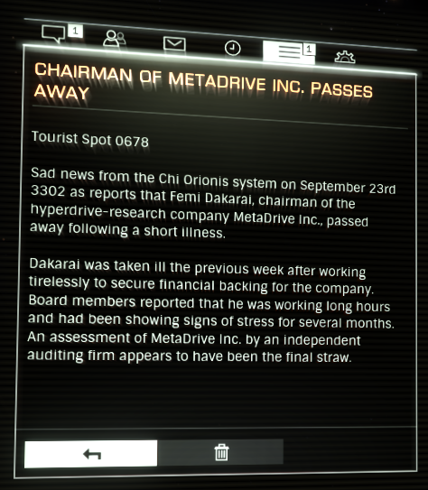

:PROPERTIES:
:ID:       8d79fea4-2836-48bb-a938-24bd597b0b61
:END:
#+title: Chairman of Metadrive Inc. Passes Away
#+filetags: :Tourist:History:beacon:3302:Death:
* 0678 Chairman of Metadrive Inc. Passes Away
[[id:2a4e7539-b87c-4ce9-8012-b2690fa3b618][Chi Orionis]]

Sad News from the [[id:2a4e7539-b87c-4ce9-8012-b2690fa3b618][Chi Orionis]] System on September 23rd 3302 as reports
that [[id:9752d776-cd68-44a0-84fe-18132d8b5e74][Femi Dakarai]], chairman of the hyperdrive-research company
[[id:f778f4fa-9cd0-4e2c-b3f4-6ee7adac4d03][MetaDrive]] Inc., passed away following a short [[id:69227f29-d307-4b65-a31d-27cd23a5aeb1][illness]].

Dakarai was taken ill the previous week after working tirelessly to
secure financial backing for the company. Board members reported that
he was working long hours and had been showing signs of stress for
several months. An assessment of [[id:f778f4fa-9cd0-4e2c-b3f4-6ee7adac4d03][MetaDrive]] Inc. by independent auditor [[id:68956273-c433-4aac-aac3-1ebe826337e5][BigSix]] appears to have been the final straw.

