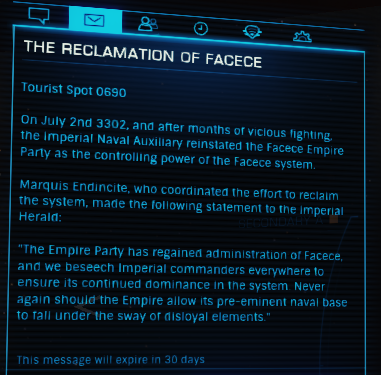

:PROPERTIES:
:ID:       1062402b-b982-499d-85ce-fbaa7570939f
:END:
#+title: The Reclamation of Facece
#+filetags: :Tourist:History:beacon:Empire:
* 0690 The Reclamation of [[id:73e31493-0c88-4fd7-9f49-9f3f1c92db41][Facece]]
[[id:73e31493-0c88-4fd7-9f49-9f3f1c92db41][Facece]]

On July 2nd 3302, and after months of vicious fighting, the Imperial
Naval Auxiliary reinstated the [[id:73e31493-0c88-4fd7-9f49-9f3f1c92db41][Facece]] Empire Party as the controlling
power of the [[id:73e31493-0c88-4fd7-9f49-9f3f1c92db41][Facece]] system.

Marquis Endincite, who coordinated the effort to reclaim the system,
made the following statement to the [[id:626a18d7-ad16-4093-b9be-d9dc1940594b][Imperial Herald]]:

"[[id:77cf2f14-105e-4041-af04-1213f3e7383c][The Empire]] Party has regained the administration of [[id:73e31493-0c88-4fd7-9f49-9f3f1c92db41][Facece]], and we
beseech Imperial commanders everywhere to ensure its continued
dominance in the system. Never again should the Empire allow its
pre-eminent naval base to fall under the sway of disloyal elements."

