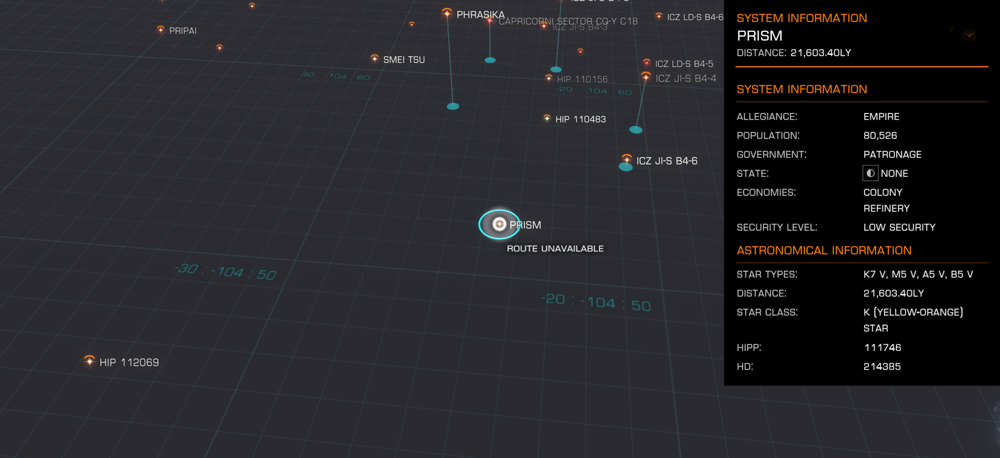

:PROPERTIES:
:ID:       8da12af2-6006-4e7e-a45e-7bf8b2c299c8
:ROAM_REFS: https://elite-dangerous.fandom.com/wiki/Prism
:END:
#+title: Prism
#+filetags: :System:

#+begin_quote
Chione was a pleasant pastoral moon until the Prism system was
seized by the Loren 'Lineage' (an Imperial family distantly related
to the ruling Duval Dynasty) in 3297. The system remains unstable at
this time and traders are advised to proceed with caution.Loren's
Legion was commissioned by Ambassador [[id:47e03b47-2225-41ca-b331-af350e58572c][Cuthrick Delaney]],
administrator of Prism in the absence of Senator Loren, to serve as
an extension of the Prism defense force. Its charter lends
flexibility to more offensive operations throughout the
region.Loren's Legion sharply contends with enemies of the Empire in
the vicinity of Prism and serves as a bulwark against incursion into
Imperial territory.
#+end_quote

