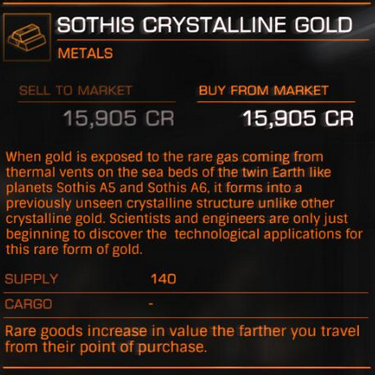

:PROPERTIES:
:ID:       488137ee-6e22-47f6-93b1-05f2a26e2780
:END:
#+title: Sothis Crystalline Gold
#+filetags: :rare:Commodity:

A rare commodity sold at [[id:15a6cb6a-a3c1-45b7-ae06-63c8e6755bca][Newholm Station]] in [[id:aa43803c-e60c-45bf-ab48-49a139931c68][Sothis]]

#+begin_quote
When gold is exposed to the rare gas coming from thermal vents on the
sea beds of the twin Earth-like planets [[id:4bced525-9b3f-4894-a1ad-546a9ef89b63][Sothis A5]] and [[id:e03a3054-bab9-4050-bb30-a86fc975fae0][Sothis A6]], it
forms into a previously unseen crystalline structure unlike other
crystalline gold. Scientists and engineers are only just beginning to
discover the technological applications for this rare form of gold.
#+end_quote

