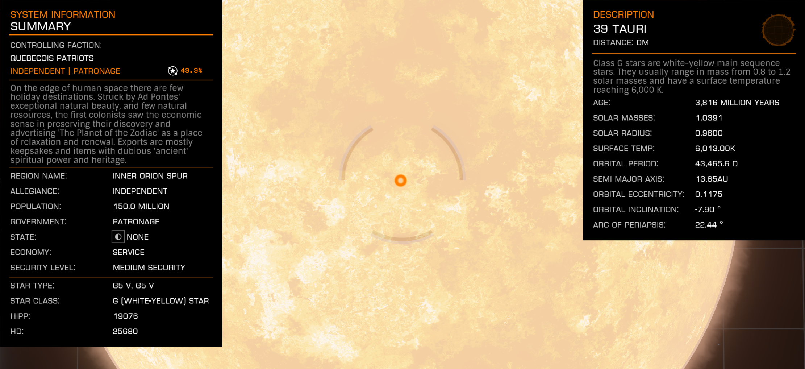

:PROPERTIES:
:ID:       7a442368-d9e1-420b-a2c4-a8900a94227d
:ROAM_REFS: https://elite-dangerous.fandom.com/wiki/39_Tauri
:END:
#+title: 39 Tauri
#+filetags: :System:

#+begin_quote
On the edge of human space there are few holiday destinations.
Struck by Ad Pontes's exceptional natural beauty, few natural
resources, and twelve orbiting ice moons, the first colonists saw
the economic sense in preserving their discovery and advertising
"The Planet of the Zodiac" as a place of relaxation and renewal.
Exports are mostly keepsakes and items with dubious "ancient"
spiritual power and heritage.
#+end_quote

Related: [[id:26709ae8-3564-45dd-b8d1-67fd8666c0c9][Ad Pontes]].

Rare commodity source: [[id:6e85e07f-bf89-40bb-9555-b1ddc7748f9a][Tauri Chimes]] at [[id:fe2bed9a-c1d4-4f1a-8708-6c51ef98865b][Porta]].
