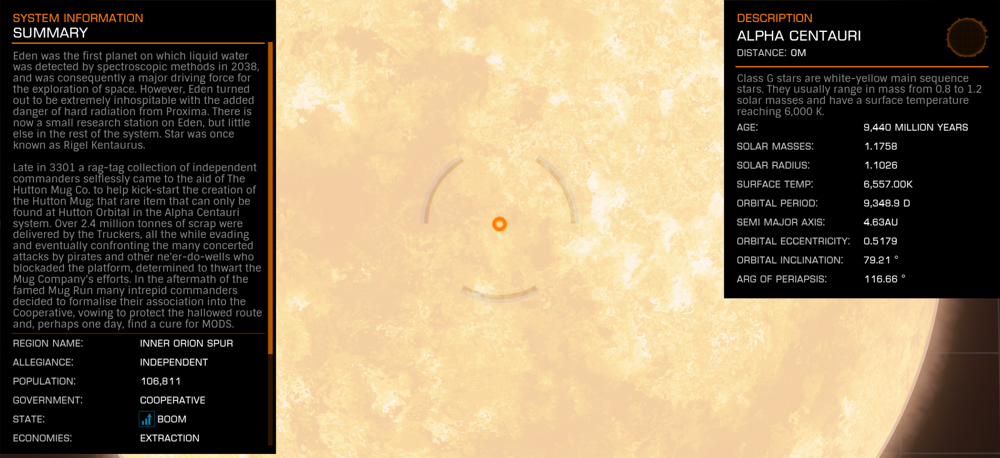

:PROPERTIES:
:ID:       2de7ac5c-9ae0-4ebf-af7d-6505f05d2fd1
:END:
#+title: Alpha Centauri
#+filetags: :3301:System:

#+begin_quote
Eden was the first planet on which liquid water was detected by
spectroscopic methods in 2038, and so it was a major driving force
for the exploration of space. However, Eden turned out to be
extremely inhospitable with the added danger of hard radiation from
Proxima. There is now a small research station on Eden, but little
else in the rest of the system. Star was once known as Rigel
Kentaurus.Late in 3301 a rag-tag collection of Independent
Commanders selflessly came to the aid of Hutton Mug Co. to help
kick-start the creation of the Hutton Mug; the rare item that can
only be found at Hutton Orbital in the Alpha Centauri system. Over
2.4 million tonnes of scrap were delivered by the Truckers, all the
while evading and eventually confronting the many concerted attacks
by pirates and other Ne'er-do-wells who blockaded the platform,
determined to block the Mug Companies[sic] efforts. In the aftermath
of the famed Mug Run many intrepid commanders decided to formalise
their association to the Co-Operative, vowing to protect the
hallowed route and, perhaps one day, find a cure for MODS.
#+end_quote

Sources: in-game system description, mirrored at [[https://elite-dangerous.fandom.com/wiki/Alpha_Centauri][Fandom: Alpha Centauri]]

Related: [[id:6003defd-b8fc-47fe-a6b2-769d6963ced1][Proxima Centauri]], [[id:9e3161ac-9252-44d0-a526-b6e289cf28ee][Hutton Orbital]], [[id:56b510cd-e1c0-4183-845f-397475330ab2][Hutton Mug]], [[id:46bf843d-4f3a-43c9-99a4-75999d94f368][MODS]].

Rare commodity source: [[id:ff00bb13-596c-4813-ac8b-03592016b323][Centauri Mega Gin]] at [[id:9e3161ac-9252-44d0-a526-b6e289cf28ee][Hutton Orbital]].
