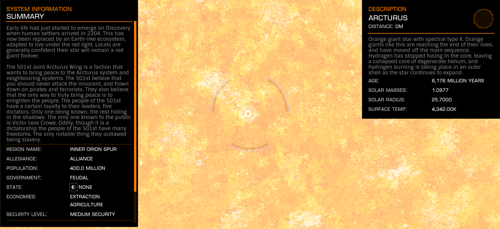

:PROPERTIES:
:ID:       74133f32-c175-450f-bd54-8ecbc8041696
:ROAM_REFS: https://elite-dangerous.fandom.com/wiki/Arcturus
:END:
#+title: Arcturus
#+filetags: :System:

#+begin_quote
Early life had just started to emerge on Discovery when the human
settlers arrived in 2304. This has now been replaced by an Earth-
like ecosystem, adapted to live under the red light. Locals are
generally confident their star will remain a red giant forever.
#+end_quote

