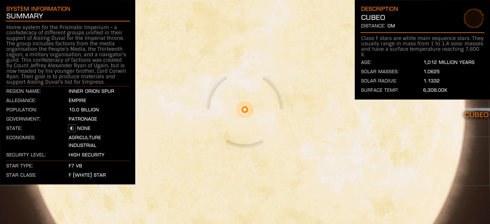

:PROPERTIES:
:ID:       1cfcec06-5ac3-40b6-b08a-13086eb88466
:END:
#+title: Cubeo
#+filetags: :System:

#+begin_quote
"Home system for the Prismatic Imperium - a confederacy of different groups unified in their support of Aisling Duval for the Imperial throne.
The group includes factions from the media organisation the People's Media, the Thirteenth Legion, a military organisation, and a navigator's guild. This confederacy of factions was created by Count Jeffrey Alexander Ryan of Ugain, but is now headed by his younger brother, Lord Corwin Ryan.
Their goal is to produce materials and support [[id:b402bbe3-5119-4d94-87ee-0ba279658383][Aisling Duval]]'s bid for Empress."
#+end_quote

