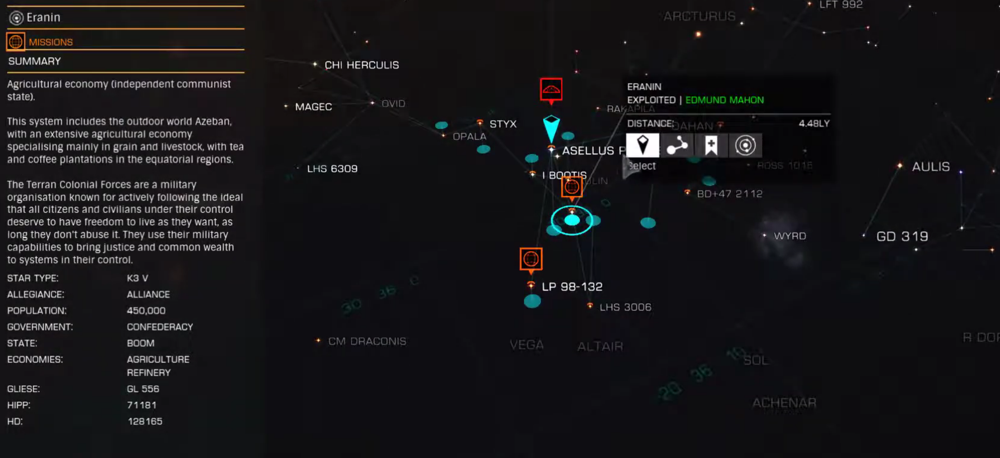

:PROPERTIES:
:ID:       f38c2905-34c5-45c1-a2f5-2ec352b6630f
:ROAM_REFS: https://elite-dangerous.fandom.com/wiki/Eranin
:END:
#+title: Eranin
#+filetags: :System:

#+begin_quote
This system includes the outdoor world Azeban, with an extensive
agricultural economy specializing mainly in grain and livestock,
with tea and coffee plantations in the equatorial regions.
#+end_quote

Rare commodity source: [[id:4b31a774-1f16-4b74-964f-df0460e058af][Eranin Pearl Whisky]] at [[id:363515bb-42b1-47fe-88c0-902464428f71][Azeban City]].

