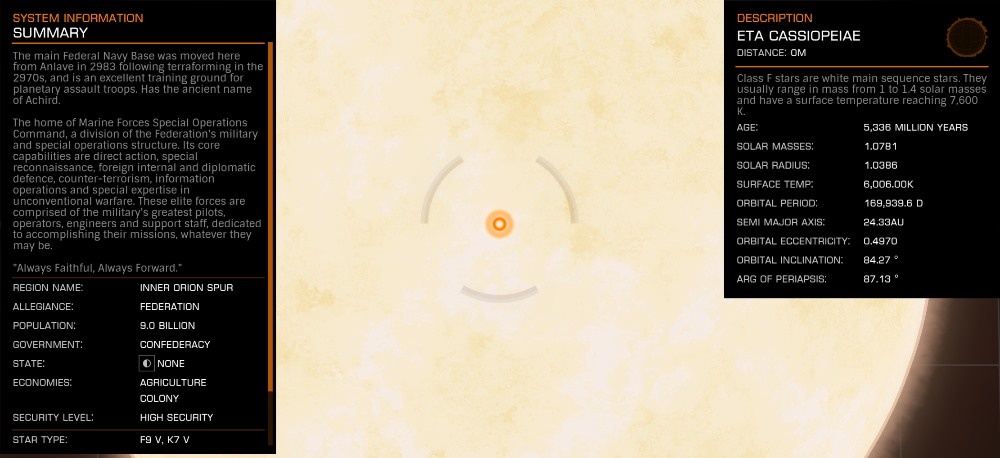

:PROPERTIES:
:ID:       ed325fe8-22a1-4d07-9af9-5a9f8f056377
:ROAM_REFS: https://elite-dangerous.fandom.com/wiki/Eta_Cassiopeiae
:END:
#+title: Eta Cassiopeiae
#+filetags: :System:

#+begin_quote
The main Federal Navy Base was moved here from Anlave in 2983
following terraforming in the 2970s, and is an excellent training
ground for planetary assault troops. Has the ancient name of
Achird.The home of Marine Forces Special Operations Command, a
division of the Federation's military and special operations
structure. Its core capabilities are direct action, special
reconnaissance, foreign internal and diplomatic defence, counter-
terrorism, information operations and special expertise in
unconventional warfare. These elite forces are comprised of the
military's greatest pilots, operators, engineers and support staff,
dedicated to accomplishing their missions, whatever they may
be."Always Faithful, Always Forward."
#+end_quote

