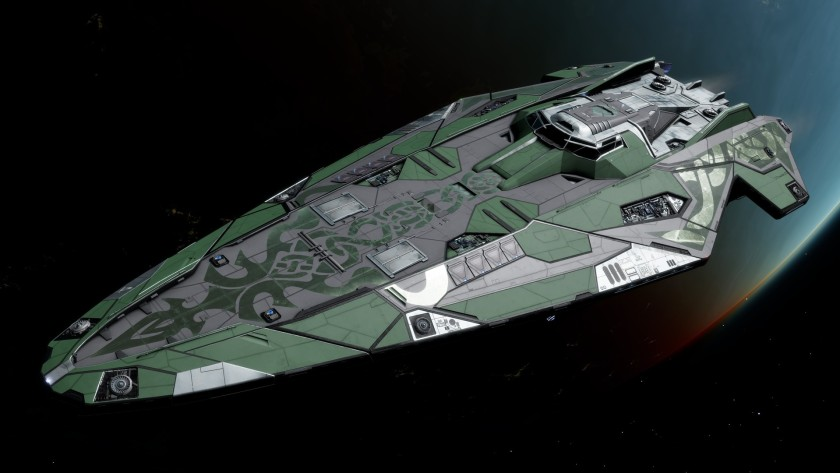

:PROPERTIES:
:ID:       79778442-b881-46ca-8783-f6d9bc4b8233
:ROAM_REFS: https://www.elitedangerous.com/equipment/starships/anaconda
:END:
#+title: Anaconda
#+filetags: :ship:

* Shipyard Stats
- Fighter bay: Yes
- Multicrew: +3
- Landing pad size: LRG
- Speeds: 183 m/s top, 244 m/s boost
- Maneuverability: 1
- Jump range: 8.54 ly laden, 9.66 ly unladen
- Durability: 362 shields, 945 armour
- Hull mass: 400 t
- Cargo capacity: 114 t
- Dimensions: 31 m high, 152.4 m long, 61.8 m wide

