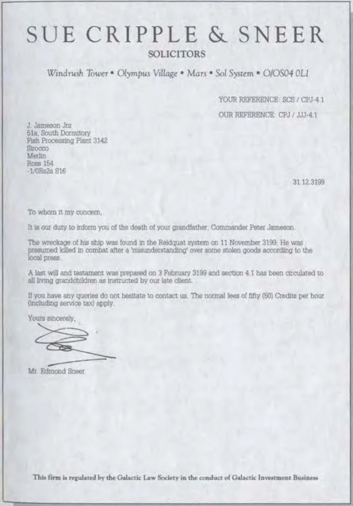
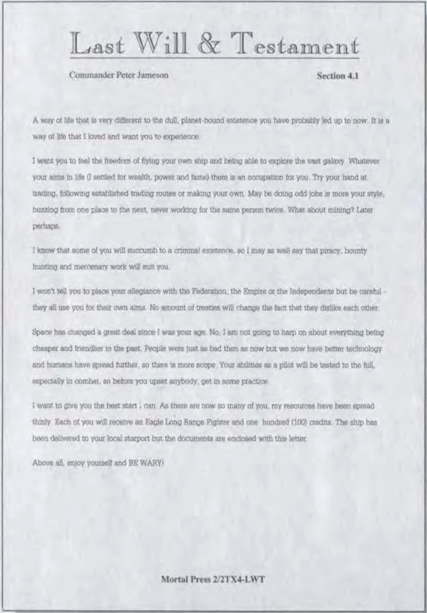

:PROPERTIES:
:ID:       af79e12c-6bc7-42ef-ade4-688b6454308a
:ROAM_REFS: https://archive.org/details/frontier-manual/page/n1/mode/2up
:END:
#+title: Peter Jameson
#+filetags: :Individual:3199:

First Commander to have the [[id:088cf15e-3c00-4522-8c15-aa4c8b30ea8c][Elite]] badge.

Piloting a [[id:83299a14-b6b0-4670-ba39-2914e05ed2f5][Cobra Mk III]]

* Death

The wreckage of Jameson's ship was found in the [[id:633a799b-8c05-4136-8f94-cf169eab515f][Riedquat]] system on 11 November 3199. He was presumed killed in combat after a "misunderstanding" over stolen goods.

The *Frontier: Elite II* manual misspells the system as "Reidquat"; the canonical system name is Riedquat.

