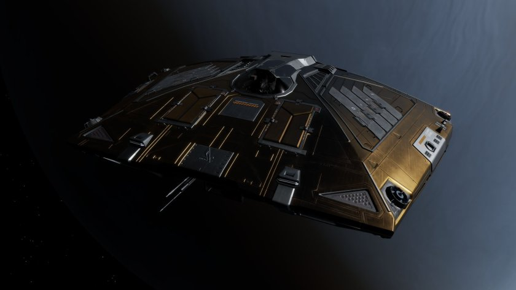

:PROPERTIES:
:ID:       0127a175-4bb8-4bf7-924c-37273661a623
:ROAM_REFS: https://www.elitedangerous.com/equipment/starships/sidewinder
:END:
#+title: Sidewinder
#+filetags: :ship:

* Shipyard Stats
- Fighter bay: No
- Multicrew: -
- Landing pad size: SML
- Speeds: 221 m/s top, 322 m/s boost
- Maneuverability: 6
- Jump range: 7.25 ly laden, 8.15 ly unladen
- Durability: 52 shields, 108 armour
- Hull mass: 25 t
- Cargo capacity: 4 t
- Dimensions: 5.4 m high, 14.9 m long, 21.4 m wide

