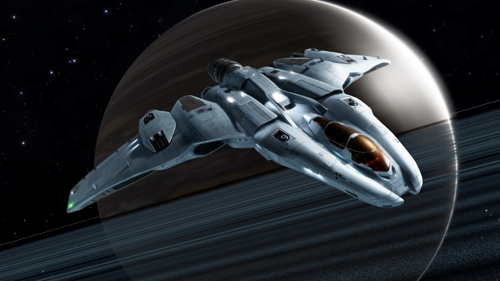

:PROPERTIES:
:ID:       55bc934d-fae8-4cf7-afbc-825ef95e82af
:ROAM_REFS: https://www.elitedangerous.com/equipment/starships/mandalay
:END:
#+title: Mandalay
#+filetags: :3310:ship:

Ship by [[id:d24ee8f5-e2ec-4c71-b5fa-afc2d9710141][Zorgon Peterson]] released in 3310

* Shipyard Stats
- Fighter bay: No
- Multicrew: +1
- Landing pad size: MED
- Speeds: 285 m/s top, 357 m/s boost
- Maneuverability: 5
- Jump range: 18.76 ly laden, 22.26 ly unladen
- Durability: 269 shields, 414 armour
- Hull mass: 230 t
- Cargo capacity: 40 t
- Dimensions: 14.9 m high, 49.6 m long, 74.4 m wide

