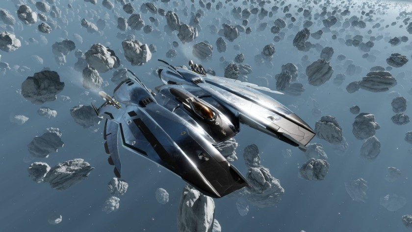

:PROPERTIES:
:ID:       7e5ca3fc-34b8-4987-9873-74e9266ffc9f
:ROAM_REFS: https://www.elitedangerous.com/equipment/starships/mamba
:END:
#+title: Mamba
#+filetags: :3304:ship:

Ship by [[id:d24ee8f5-e2ec-4c71-b5fa-afc2d9710141][Zorgon Peterson]] released in 3304

* Shipyard Stats
- Fighter bay: No
- Multicrew: +1
- Landing pad size: MED
- Speeds: 316 m/s top, 387 m/s boost
- Maneuverability: 3
- Jump range: 6.37 ly laden, 6.79 ly unladen
- Durability: 244 shields, 414 armour
- Hull mass: 250 t
- Cargo capacity: 20 t
- Dimensions: 11.4 m high, 72.2 m long, 50.1 m wide

