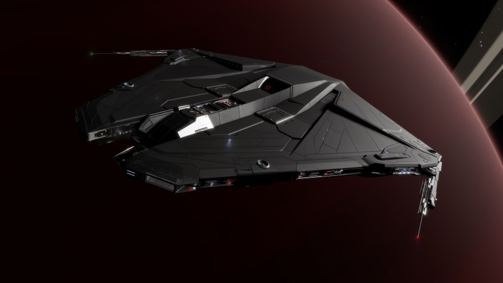

:PROPERTIES:
:ID:       2ac8fefa-cef4-4def-b737-cd784dd1a9c5
:ROAM_REFS: https://www.elitedangerous.com/equipment/starships/krait-phantom
:END:
#+title: Krait Phantom
#+filetags: :3304:ship:

Ship made by [[id:273d7834-fe3f-4b12-b045-d5d8a62e719a][Faulcon DeLacy]] and released in 3304.

* Shipyard Stats
- Fighter bay: No
- Multicrew: +1
- Landing pad size: MED
- Speeds: 256 m/s top, 358 m/s boost
- Maneuverability: 3
- Jump range: 8.23 ly laden, 9.78 ly unladen
- Durability: 260 shields, 324 armour
- Hull mass: 270 t
- Cargo capacity: 82 t
- Dimensions: 14.6 m high, 73.3 m long, 72 m wide

