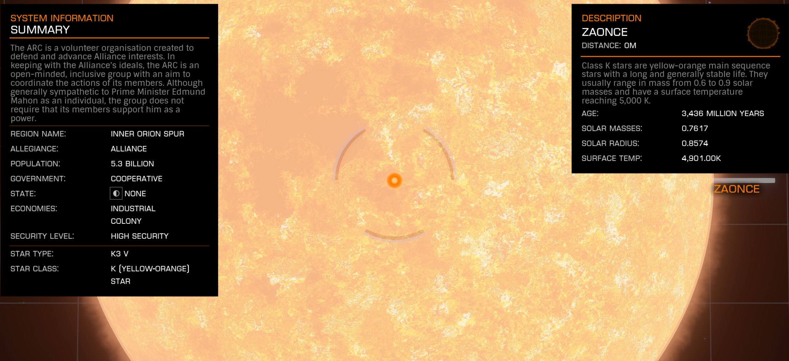

:PROPERTIES:
:ID:       4c65480c-a87b-421b-a91a-f1f1f8ecb737
:ROAM_REFS: https://elite-dangerous.fandom.com/wiki/Zaonce
:END:
#+title: Zaonce
#+filetags: :System:

#+begin_quote
The ARC is a volunteer organisation created to defend and advance
Alliance interests. In keeping with the Alliance's ideals, the ARC
is an open-minded, inclusive group with an aim to coordinate the
actions of its members. Although generally sympathetic to Prime
Minister Edmund Mahon as an individual, the group does not require
that its members support him as a power.
#+end_quote

Rare commodity source: [[id:a8d0887c-745d-4977-9b0c-0aef936d67f5][Leathery Eggs]] at [[id:07d8b7e4-3061-436a-9287-00d7be4201f4][Ridley Scott]].

