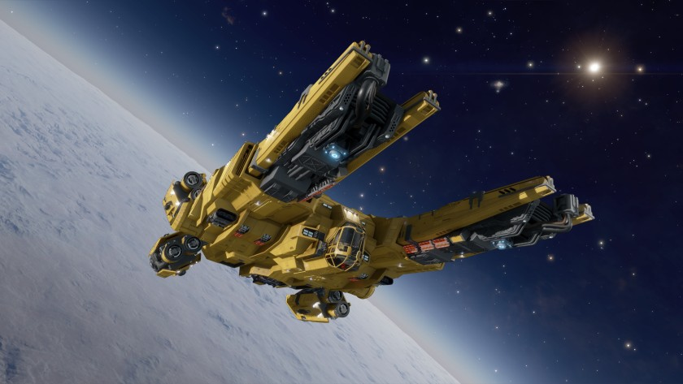

:PROPERTIES:
:ID:       cbcc7192-cc42-4692-875e-71381c29eb33
:ROAM_REFS: https://www.elitedangerous.com/equipment/starships/type-8-transporter
:ROAM_ALIASES: "Type-8"
:END:
#+title: Type-8 Transporter
#+filetags: :ship:

* Shipyard Stats
- Fighter bay: No
- Multicrew: -
- Landing pad size: MED
- Speeds: 201 m/s top, 342 m/s boost
- Maneuverability: 1
- Jump range: 17.55 ly laden, 24.68 ly unladen
- Durability: 122 shields, 792 armour
- Hull mass: 400 t
- Cargo capacity: 176 t
- Dimensions: 25.63 m high, 99.34 m long, 59.96 m wide

