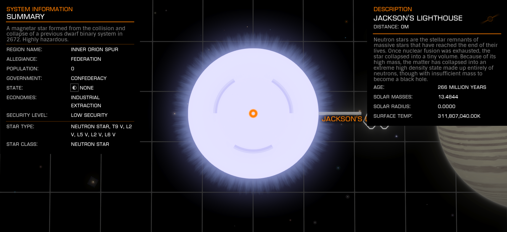

:PROPERTIES:
:ID:       ce356e04-fc18-48a8-8167-913a4e6ab00e
:ROAM_REFS: https://elite-dangerous.fandom.com/wiki/Jackson's_Lighthouse
:END:
#+title: Jackson's Lighthouse
#+filetags: :System:

#+begin_quote
A magnetar star formed from the collision and collapse of a previous
dwarf binary system in 2672. Highly hazardous.
#+end_quote

