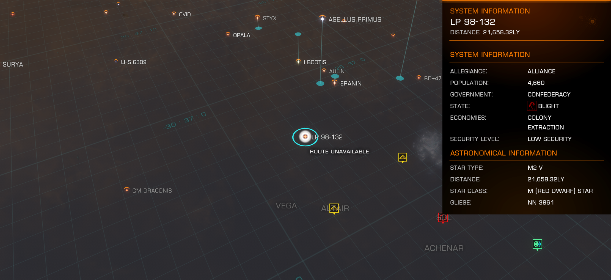

:PROPERTIES:
:ID:       39dc61d6-e82b-421d-8110-cf5882f647c6
:ROAM_REFS: https://elite-dangerous.fandom.com/wiki/LP_98-132
:END:
#+title: LP 98-132
#+filetags: :System:

#+begin_quote
Poor, low population extraction economy (anarchy).LP 98-132 is an
anarchic system with a solitary small M2V type dim red star. There
isn't a lot here, though there is some mining of valuable minerals
like cobalt, rutile and coltan, and very occasionally of gold.
Piracy is rife here with pirates on the lookout for those high value
cargos. There is a station called Freeport operated by a group of
locals, and this is the nearest thing to law that exists in the
system.
#+end_quote

