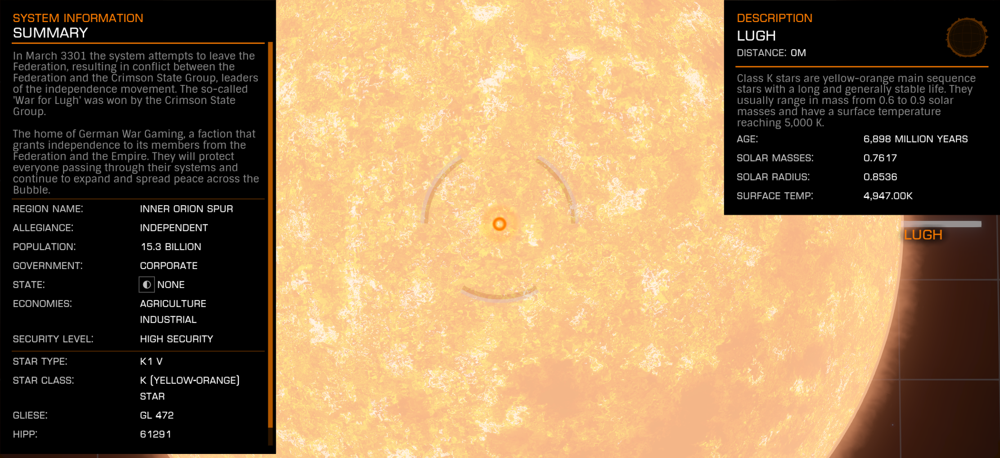

:PROPERTIES:
:ID:       5a007482-56ef-4f60-83e7-58b4089a0020
:ROAM_REFS: https://elite-dangerous.fandom.com/wiki/Lugh
:END:
#+title: Lugh
#+filetags: :System:

#+begin_quote
In March 3301 the system attempts to leave the Federation, resulting
in conflict between the Federation and the Crimson State Group,
leaders of the independence movement. The so-called 'War for Lugh'
was won by the Crimson State Group.
#+end_quote

